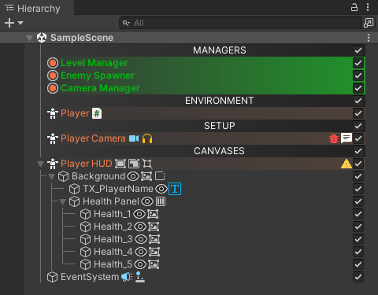

# Hierarchy Enhancer

This tool was born out of a personal need for better organization in the Hierarchy view as the built-in one is pretty basic.

### Content

[**Features**](#features) - [**Installation**](#installation) - [**First Setup**](#first-setup) - [**Known Issues**](#known-issues) - [**Screen Shots**](#screen-shots)

---

### Features

Each feature can be enabled or disabled so that only the ones needed are active.

Colored Hierarchy [Gradient Support]
 

    Custom labels support : Custom Icon, Text & Background Color, Bold or Italic, Size & Custom Font.

Tree View
 

    The tree view helps understanding the nesting level of parents and children.

Components Visualization [Hide in inspector when clicked]
 

    Quickly find which GameObjects hold a certain component.

Custom Tooltips & Icons
 

    Add Icons to a preferred GameObject that when hovered reveal a tooltip. click the icon to open a window where you can write instructions related to the icon.

Quick Toggle Set Active
 

    Toggle ON or OFF GameObjects from the hierarchy

 

---

### Installation

1. From the main branch click the **`[Code]`** button and copy the HTTPS link.
2. In Unity, open the package manager and click the **`[+]`** icon on the top left screen.
3. Select **`[Add package from git URL]`** and paste the link copied in step 1.

---

### First Setup

In order to start using the tool you will need to open the Manager Window found in the Menu at **`[epoHless/Enhanced Hierarchy Manager]`** and in the option tab press the button **`[Change Default Directory]`**, a window will open asking you to select the folder where to save the data.

You may now start creating custom labels for the hierarchy in the **`[Labels]`** tab from the bottom of the screen.

---

### Known Issues

| **Issue**                                | **Status**     |
|------------------------------------------|----------------|
| Labels are not fetched on Project Opened | ⚒️ In Progress |
| Manager's UI Rework                      | ⚒️ In Progress |
| GameObject Tab Height                    | ⚒️ In Progress |

---

### Screen Shots

